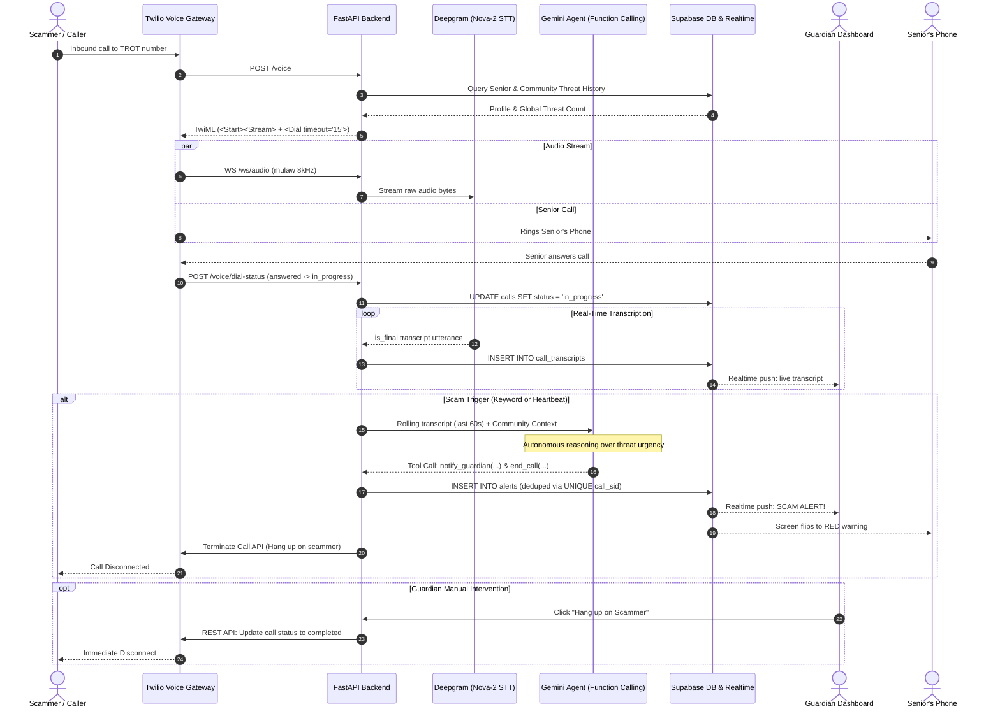

# TROT: Comprehensive System Architecture & Engineering Plan

> **TROT (Threat Reduction and Oversight Technology)**  
> Real-time voice scam protection for seniors powered by streaming telephony, Deepgram Nova-2 STT, Gemini agentic function calling, and Supabase Realtime.

---

## 1. System Vision & The Pitch

> *"A scam call used to be a private, manipulative moment between a predator and an isolated senior. TROT puts a family member and an AI guardian in the room in real time, without the senior having to lift a finger."*

### How It Works at a Glance:
1. The senior is assigned a TROT (Twilio) phone number that transparently forwards to their personal phone.
2. When a call arrives, Twilio forks the caller's audio track via WebSocket to our FastAPI backend.
3. Audio streams live into **Deepgram Nova-2** at 8000 Hz, emitting confirmed (`is_final`) utterances.
4. An autonomous **Gemini Agent** monitors the rolling transcript. When red flags or heartbeat checks trigger, Gemini evaluates the call and executes **autonomous defense tools** (`notify_guardian`, `warn_senior`, `end_call`, `block_number`).
5. A **Shared Community Network** instantly identifies repeat scam numbers across all TROT users.
6. The Guardian monitors the call in real time and holds a **Remote Kill Switch** to disconnect the scammer with a single tap.

---

## 2. End-to-End Architecture Diagram



---

## 3. Deep Dive: The 3 Core Architectural Upgrades

### Upgrade A: Autonomous Gemini Function Calling (Agentic Defense)
Instead of returning a passive JSON score, Gemini operates as an **autonomous active defense agent** equipped with 4 distinct tools:

```python
# Gemini Tool Definitions
tools = [
    {
        "name": "notify_guardian",
        "description": "Alerts the guardian dashboard and triggers an urgent buzz notification.",
        "parameters": {
            "type": "OBJECT",
            "properties": {
                "scam_type": {"type": "STRING", "description": "e.g. grandchild_in_jail, bank_fraud, irs_warrant"},
                "severity": {"type": "STRING", "enum": ["medium", "high"]},
                "confidence": {"type": "NUMBER", "description": "Confidence score from 0.0 to 1.0"},
                "reason": {"type": "STRING", "description": "Plain language explanation of the red flags"}
            },
            "required": ["scam_type", "severity", "confidence", "reason"]
        }
    },
    {
        "name": "warn_senior",
        "description": "Plays an urgent spoken warning into the call to advise the senior to hang up.",
        "parameters": {
            "type": "OBJECT",
            "properties": {
                "message": {"type": "STRING", "description": "Spoken warning message for the senior"}
            },
            "required": ["message"]
        }
    },
    {
        "name": "end_call",
        "description": "Autonomously terminates the active phone call if high-confidence imminent harm is detected.",
        "parameters": {
            "type": "OBJECT",
            "properties": {
                "reason": {"type": "STRING", "description": "Why the call was forcefully disconnected"}
            },
            "required": ["reason"]
        }
    },
    {
        "name": "block_number",
        "description": "Marks the caller's phone number as suspicious across the network.",
        "parameters": {
            "type": "OBJECT",
            "properties": {
                "reason": {"type": "STRING", "description": "Justification for blocking"}
            },
            "required": ["reason"]
        }
    }
]
```

#### Decision Logic:
* **Confidence Threshold:** Tools are only executed if Gemini's confidence $\ge 0.70$.
* **Deduplication:** Alert rows are inserted with `ON CONFLICT (call_sid) DO NOTHING`. Side effects run only if a new row is created.
* **Proportional Response:**
  * Suspicious questions $\rightarrow$ `notify_guardian`.
  * Active gift card / wire transfer instruction $\rightarrow$ `notify_guardian` + `warn_senior`.
  * Aggressive coercion or threats $\rightarrow$ `end_call` + `block_number`.

---

### Upgrade B: Guardian Real-Time Remote Kill Switch
The Guardian dashboard empowers the trusted family member to take control:
1. **Live Transcript Streaming:** `call_transcripts` rows stream directly into the dashboard via Supabase Realtime without manual polling.
2. **Scam Alert Banner:** Highlights red flags and Gemini's plain-language explanation.
3. **Remote "Hang Up on Scammer" Button:**
   - Triggers `POST /api/calls/terminate` (or FastAPI `POST /calls/{call_sid}/terminate`).
   - Executes Twilio call termination:
     ```python
     twilio_client.calls(call_sid).update(status="completed")
     ```
   - Instantly disconnects the scammer while freeing the senior's phone.

---

### Upgrade C: Shared Community Reputation Network
Fraud rings frequently target multiple seniors using the same spoofed or VOIP numbers. TROT pools reputation data across all users:
1. **Global Threat Lookup:** On incoming webhook (`POST /voice`):
   ```sql
   SELECT SUM(threat_count) AS total_network_threats 
   FROM numbers 
   WHERE number = :caller_number;
   ```
2. **Context Injection:** If `total_network_threats > 0`, Gemini receives historical context before analyzing:
   > *"Community Intelligence Alert: This caller (+12105550199) has been flagged 3 times across the TROT network for prior fraud attempts."*
3. **Immediate Scrutiny:** Lowers the keyword threshold and prompts Gemini to evaluate early utterances with heightened suspicion.

---

## 4. Phase-by-Phase Roadmap

### Phase 0: Telephony Plumbing (Status: COMPLETE ✅)
- Supabase schema executed (`init.sql`).
- Test profiles seeded (Grandpa & Isabel).
- `POST /voice` incoming webhook operational with `<Dial>` bridge.
- Verified live call routing and caller ID presentation.

### Phase 1: Call Lifecycle & Audio Streaming (Status: IN PROGRESS ⏳)
- **Sub-Phase 1A (COMPLETE ✅):** Call lifecycle state machine (`/voice/dial-status`, `/voice/dial-complete`, `timeout="15"`).
- **Sub-Phase 1B (COMPLETE ✅):** Twilio Media Stream WebSocket (`WS /ws/audio`) decoding mulaw 8000Hz packets.
- **Sub-Phase 1C (NEXT UP 🔜):** Deepgram Nova-2 streaming STT integration & `call_transcripts` persistence.
  - *Checkpoint:* Spoken words on call insert as rows in Supabase and log to console in real time.

### Phase 2: Autonomous Agentic Defense Engine
- Rolling transcript memory buffer (~60s window).
- Keyword trigger regex + 20s heartbeat checker.
- Community threat context injection.
- Gemini Function Calling implementation (`notify_guardian`, `warn_senior`, `end_call`, `block_number`).
- Offline replay testing via `replay_transcript.py` against scam scripts.
  - *Checkpoint:* Replaying a scam transcript triggers autonomous tool calls with exactly 1 alert; benign call triggers 0.

### Phase 3: Auth, Pairing & Realtime Dashboards
- Supabase Auth (Google OAuth + email fallback) and role picker.
- Pairing flow via single-use `pairing_code` and service role route handler (`/api/pair`).
- Senior Calm Screen (`/senior`): Protected (green) $\rightarrow$ Active Call $\rightarrow$ Possible Scam (red).
- Guardian Dashboard (`/guardian`): Live call bar, auto-scrolling transcript, alert feed, and **Remote Kill Switch ("Hang up on Scammer")**.
  - *Checkpoint:* Live demo showing transcript streaming onto guardian dashboard and the remote kill switch hanging up the call.

### Phase 4: Polish, Outbound Buzz & Demo Rehearsal
- Outbound Twilio voice buzz call to guardian on alert (`notify.py`).
- Seed realistic demo data (past flagged numbers and history).
- Backup demo video recording.

---

## 5. Security & Privacy Safeguards
1. **Inbound Audio Only:** `<Start><Stream>` captures only the caller's track. The senior's side is never transcribed or sent to the cloud.
2. **Row-Level Security (RLS):** Guardians only ever see calls and alerts belonging to their linked senior (`guardian_id = auth.uid()`).
3. **No Unauthenticated State Mutations:** `profiles` table has zero public update policies; pairing is strictly mediated by server-side service role route handlers.
4. **Secrets Isolation:** All API keys (`TWILIO_*`, `DEEPGRAM_*`, `GEMINI_*`, `SUPABASE_SERVICE_ROLE_KEY`) are server-only and gitignored.
