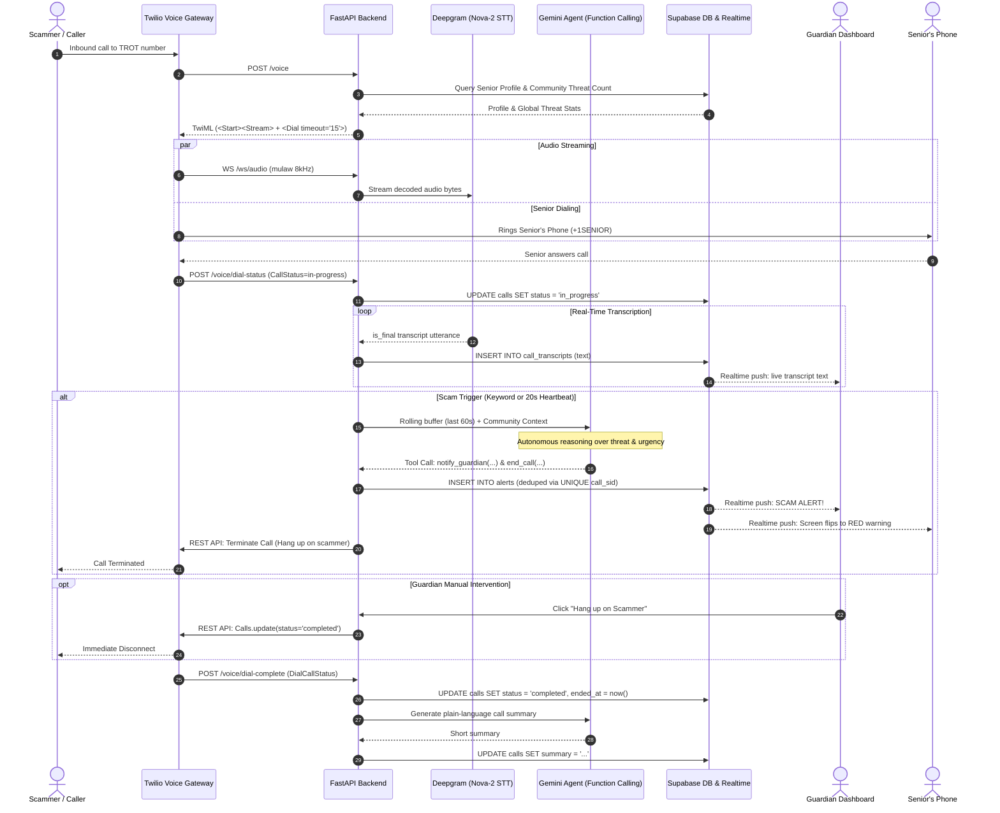

# TROT: Comprehensive System Architecture & Engineering Plan

> **TROT (Threat Reduction and Oversight Technology)**  
> Real-time voice scam protection for seniors powered by streaming telephony, Deepgram Nova-2 STT, autonomous Gemini function calling, and Supabase Realtime.

---

## 1. System Vision & Value Proposition

> *"A scam call used to be a private, manipulative moment between a predator and an isolated senior. TROT puts a family member and an autonomous AI defense agent in the room in real time, without the senior having to lift a finger."*

### Core Value Proposition:
1. **Frictionless Senior Experience:** The senior keeps their normal phone habits. No apps to configure before picking up; incoming calls to their TROT number ring their phone normally.
2. **Real-Time Intervention (Not Post-Mortem):** Existing solutions analyze voicemails or alert victims *after* money has been lost. TROT analyzes the conversation **mid-call** and can intervene before compliance occurs.
3. **Multi-Layered Protection:**
   - **Autonomous AI Defense (Gemini):** Evaluates threat severity and executes autonomous defense tools (`notify_guardian`, `warn_senior`, `end_call`, `block_number`).
   - **Human Oversight (Guardian):** Trusted family members see the live transcript and hold a remote kill switch to terminate the call instantly.
   - **Community Intelligence:** Any number flagged by one TROT user immediately alerts and protects every other user on the network.

---

## 2. End-to-End System Sequence Diagram



---

## 3. Database Schema & RLS Architecture Reference

`init.sql` / `schema.sql` is the source of truth. All phone numbers are E.164 (`+12105551234`).

### Tables & Columns
* **`profiles`**:
  - `id` (uuid, primary key, references `auth.users`)
  - `role` (`'guardian'` | `'senior'`)
  - `name` (text)
  - `phone` (text, unique): Senior's real handset number (or Guardian's optional alert number).
  - `twilio_number` (text, unique): Senior's assigned TROT phone number.
  - `guardian_id` (uuid, references `profiles(id)`): Links senior to guardian.
  - `pairing_code` (text, unique): Single-use 6-character code generated by guardian.
  - `consented_at` (timestamptz): Timestamp when senior accepts fraud monitoring consent.
* **`calls`**:
  - `id` (uuid, primary key)
  - `call_sid` (text, unique): Twilio parent CallSid.
  - `senior_id`, `guardian_id` (uuid references `profiles`)
  - `from_number` (text): Caller's phone number.
  - `status` (`'ringing'`, `'in_progress'`, `'completed'`, `'no_answer'`, `'busy'`, `'failed'`)
  - `risk` (`'none'`, `'suspicious'`, `'scam'`)
  - `summary` (text): Gemini-generated plain-language call summary.
  - `started_at`, `ended_at` (timestamptz)
* **`call_transcripts`**:
  - `id` (uuid, primary key)
  - `call_sid`, `senior_id`, `guardian_id`
  - `text` (text): Confirmed final transcript line.
  - `created_at` (timestamptz)
* **`alerts`**:
  - `id` (uuid, primary key)
  - `call_sid` (unique constraint `alerts_one_per_call`)
  - `senior_id`, `guardian_id`, `contact_number`
  - `scam_type` (text, e.g. `'grandchild_in_jail'`, `'bank_fraud'`, `'tech_support'`, `'irs_warrant'`)
  - `severity` (`'medium'`, `'high'`)
  - `confidence` (numeric, 0.0 - 1.0)
  - `trigger` (`'keyword'`, `'heartbeat'`)
  - `summary` (text): Plain-language reason displayed to guardian.
  - `acknowledged` (boolean, default false)
* **`numbers`**:
  - `senior_id`, `guardian_id`, `number`
  - `status` (`'unknown'`, `'trusted'`, `'suspicious'`)
  - `threat_count` (int, default 0)
  - `last_seen` (timestamptz)
  - Unique constraint: `(senior_id, number)`

### Security & Row-Level Security (RLS) Rules:
1. **Backend & Route Handlers:** Use `SUPABASE_SERVICE_ROLE_KEY` to bypass RLS for background ingestion and pairing.
2. **Browser Frontend:** Uses `NEXT_PUBLIC_SUPABASE_ANON_KEY`. Enforces RLS:
   - Guardians only see rows where `guardian_id = auth.uid()`.
   - Seniors only see rows where `senior_id = auth.uid()`.
3. **No Browser Profile Updates:** The `profiles` table intentionally has **no UPDATE policy** for users. All updates to `pairing_code`, `guardian_id`, and `phone` must go through server-side route handlers.
4. **Realtime Gating:** Realtime publication includes `calls`, `call_transcripts`, `alerts`, `profiles`. RLS applies to Realtime events automatically.

---

## 4. Detailed Phase Engineering Blueprint

---

### Phase 0: Telephony Plumbing
**Status:** COMPLETE ✅ (Verified on live phones)

* **Objective:** Establish Twilio voice webhook ingress and transparent call bridging to the senior's phone without `callerId` masking.
* **Key Files:**
  - `backend/db.py`: `get_senior_by_twilio_number`, `upsert_caller_number`, `insert_call`.
  - `backend/main.py`: `POST /voice` (and alias `/twilio/voice`).
* **Implementation Details:**
  1. Incoming call to `To` queries `profiles` where `twilio_number = To`.
  2. If found, logs caller to `numbers` and inserts call row into `calls` (`status='ringing'`).
  3. Returns minimal TwiML dialing senior's phone:
     ```xml
     <Response>
       <Dial><Number>+1SENIOR_PHONE</Number></Dial>
     </Response>
     ```
  4. `callerId` is omitted so Twilio presents the original caller's caller ID to the senior.
* **Checkpoint Result:** Verified on live phone call; senior's phone rang and connected.

---

### Phase 1: Call Lifecycle & Audio to Live Transcript
**Status:** COMPLETE ✅ (Verified on live phones & test suites)

#### Sub-Phase 1A: Telephony State Machine & Callbacks (COMPLETE ✅)
* **Commits:** `12c108c`, hardened in `2e6a22a`
* **Files Modified:** `backend/main.py`, `backend/db.py`, `backend/scripts/test_voice.py`
* **Implementation:**
  - TwiML `<Dial>` configured with `timeout="15"` and `action="/voice/dial-complete"`.
  - Nested `<Number statusCallback="/voice/dial-status" statusCallbackEvent="answered completed">`.
  - `POST /voice/dial-status`: On `CallStatus in ('in-progress', 'answered')`, updates `calls.status = 'in_progress'` in memory and DB. Immediate fallback: on `CallStatus in ('no-answer', 'busy', 'failed', 'canceled')`, immediately marks `calls.status = 'no_answer'` without waiting for `dial-complete`.
  - `POST /voice/dial-complete`: Normalizes `DialCallStatus` and returns `<Response><Hangup/></Response>`.
* **Verification:** Verified via automated unit tests in `test_voice.py` and live calls.

#### Sub-Phase 1B: Twilio Audio Media Stream Ingress (COMPLETE ✅)
* **Commit:** `17055c7`
* **Files Modified:** `backend/main.py`, `backend/scripts/test_voice.py`
* **Implementation:**
  - Added `<Start><Stream url="wss://HOST/ws/audio" />` **strictly before** `<Dial>`.
  - Inbound-only track streams caller audio exclusively.
  - Implemented `WS /ws/audio` with Twilio protocol decoder (`connected`, `start`, `media`, `stop`).
* **Verification:** Verified via `test_voice.py` and live streaming calls.

#### Sub-Phase 1C: Deepgram Nova-2 Streaming STT & Database Writes (COMPLETE ✅)
* **Commit:** `de1fe00`
* **Files Created / Modified:** `backend/services/transcribe.py`, `backend/main.py`, `backend/db.py`, `backend/requirements.txt`
* **Implementation:**
  - Integrated `deepgram-sdk>=3.0.0` (`AsyncDeepgramClient`) streaming `nova-2` mulaw 8000Hz.
  - In-progress gating: `get_active_call_status(call_sid) == "in_progress"`. Only speech uttered after the senior answers is recorded; ringback tones and carrier voicemails are filtered.
  - Persists each `is_final` utterance to Supabase `call_transcripts` table in real time.
* **Verification:** Verified via live phone call test; transcripts verified in Supabase Table Editor and console logs.

---

### Phase 2: Autonomous Detection Engine & Agentic Defense
**Status:** COMPLETE ✅ (Verified on test harness & live phone call)

* **Objective:** Autonomous real-time threat detection using a rolling memory buffer, hybrid triggers (regex keywords + 20s heartbeat), network-wide reputation context, autonomous Gemini function calling, and spoken senior safety warning.
* **Model:** `gemini-3.5-flash-lite` via official `google-genai` SDK (`gemini-3.5-flash-lite`).
* **Files Created & Enhanced:**
  - `backend/services/detector.py`: Rolling buffer manager (last 60s), regex keyword matcher, 20s heartbeat asyncio task, debounce lock, child leg tracking.
  - `backend/services/classifier.py`: Gemini agent using `google-genai` SDK with declared function tools (`notify_guardian`, `warn_senior`, `end_call`, `block_number`) and risk-aware call summarizer.
  - `backend/services/alerts.py`: Alert deduplication insert (`ON CONFLICT (call_sid) DO NOTHING`), threat count increment, call risk update, and autonomous kill switch (`end_active_call`) with Amazon Polly TTS spoken safety message played to the senior's handset leg before disconnecting the scammer.
  - `backend/scripts/replay_transcript.py`: Offline test harness replaying 6 realistic fixture transcripts against live Gemini 3.5 Flash Lite.
  - `backend/fixtures/*.json`: 6 realistic fixtures (`grandchild_in_jail`, `irs_warrant`, `bank_fraud`, `doctor_appointment`, `family_chat`, `false_positive_bait`).
* **Implementation Details:**
  1. **Rolling Memory Buffer & Continuous Re-Evaluation:**
     - Rolling 60s window of utterances with an 8-second debounce cooldown.
     - Fast keyword path: Word-boundary regex matching scam indicators. Evaluates immediately if $\ge 15$ words and cooldown has elapsed.
     - Heartbeat path: Periodic check every 20s if new words arrived since the previous cycle.
     - In-progress gate: Audio is only analyzed while `calls.status == 'in_progress'`.
     - **Continuous Re-Evaluation & State Continuity:** The detector does NOT freeze after an initial alert. It passes previous threat state (`[ACTIVE THREAT MONITORING: ... Flagged as potential scam (X% confidence)]`) into subsequent Gemini prompts, solving rolling-window amnesia. If the scammer continues pressing demands, Gemini immediately escalates and invokes `end_call`.
     - **In-Place Alert Updates & Ratcheting:** On re-evaluation, the existing alert row in Supabase is updated in-place (`update_alert`) with escalated confidence and refined summary, preventing duplicate alert spam or multiple guardian phone buzzes while keeping the dashboard live.
  2. **Shared Community Reputation Context:**
     - Aggregates caller `threat_count` across the TROT network and injects warning context into Gemini's prompt if the number has a history of fraud.
  3. **Gemini Autonomous Tool Calling:**
     - Declared defense tools: `notify_guardian`, `warn_senior`, `end_call`, `block_number`.
     - Model autonomously chooses proportionate defense actions.
  4. **Spoken Senior Protection & Autonomous Disconnect:**
     - Twilio tracks the senior's handset leg (`child_call_sid`) via `/voice/dial-status`.
     - On scam detection, TROT plays a calm, spoken safety warning (`<Say voice="Polly.Joanna-Neural">`) directly to the senior's phone informing them of the scam interception and advising them to call their guardian, while simultaneously severing the scammer's connection.
  5. **Risk-Aware Call Summaries:**
     - Upon call completion, Gemini generates a plain-language summary formatted specifically for family caregivers, detailing the scammer's claims if intercepted.
* **Verification:**
  - **Replay Test Harness:** All 6 fixtures passed: 0 alerts on benign calls, exactly 1 alert + autonomous termination on scam calls. Re-evaluations verified with state continuity.
  - **Live Phone Test:** Live call simulating the "grandchild in jail" scam was successfully detected in real time by Gemini 3.5 Flash Lite, alert created in Supabase, and call hung up by TROT.

---

### Phase 3: Auth, Pairing, & Real-Time Dashboards
**Status:** IN PROGRESS (Frontend draft merged from teammate in PR #3 / commit `41eba0b`)
**Status:** PLANNED (Frontend guide already prepared in `docs/phase_3_frontend_guide.md`)

* **Objective:** Full user onboarding, single-use pairing flow, calm senior status screen, and rich guardian monitoring dashboard with remote kill switch.
* **Stack:** Next.js (App Router), Tailwind CSS, `@supabase/ssr`, `@supabase/supabase-js`, `lucide-react`.
* **Key Files:**
  - `app/login/page.jsx`: Auth & role picker modal (`guardian` / `senior`).
  - `app/api/pair/generate/route.js`: Generates 6-character `pairing_code` via admin service role.
  - `app/api/pair/route.js`: Links senior profile to guardian, sets phone in E.164, sets `consented_at`.
  - `app/guardian/page.jsx`: Guardian real-time dashboard.
  - `app/senior/page.jsx`: Senior calm status screen.
  - `app/api/calls/terminate/route.js` [NEW]: Endpoint for Guardian Remote Kill Switch.

#### 1. Guardian Dashboard (`/guardian`):
- **Live Call Bar:** Real-time badge showing status (`idle`, `ringing`, `in_progress`) and caller number.
- **Live Transcript Stream:** Subscribes to `postgres_changes` on `call_transcripts`:
  - Appends incoming rows directly to state (no table refetching).
  - Auto-scrolls to the latest utterance.
- **Alerts Feed:** Live cards showing `scam_type`, `confidence`, and `summary`. Includes "Acknowledge" button (`UPDATE alerts SET acknowledged = true`).
- **Suspicious Numbers List:** Shows numbers ordered by `threat_count DESC`. Includes "Mark as Trusted" button (`UPDATE numbers SET status = 'trusted'`).
- **Remote Kill Switch ("Hang up on Scammer"):**
  - High-visibility red button visible whenever a call is active or flagged.
  - Calls `POST /api/calls/terminate` with `callSid`.
  - Twilio REST API terminates the call immediately.

#### 2. Senior Calm Screen (`/senior`):
- High-contrast, large fonts, zero clutter.
- **State 1 (Protected):** Soothing green shield: *"You're protected. Calls will ring normally."*
- **State 2 (Active Call):** Indicates a call is connected.
- **State 3 (Scam Alert):** Flips in real time (via Realtime on `calls` or `alerts`) to a red/amber banner:
  > ⚠️ **"POSSIBLE SCAM DETECTED"**  
  > *"This caller may be attempting fraud. Do not send money."*  
  > **[ 📞 Call Guardian Now ]** (`<a href="tel:+1GUARDIAN_PHONE">`)

* **Checkpoint Criteria:** A live or simulated scam call updates the Guardian dashboard with live transcript and alert, senior screen flips to warning, and clicking "Hang up on Scammer" terminates the live call.

---

### Phase 4: Guardian Voice Buzz & Demo Polish
**Status:** IN PROGRESS 🚀 (Twilio Voice Buzz active in `notify.py` and `alerts.py`)

* **Objective:** Real-time outbound telephony buzz to the guardian upon scam interception, completely exempt from US carrier A2P 10DLC restrictions and requiring zero external accounts (no Meta Business needed), seed realistic demo data, rehearse live demo scripts, and record backup video.
* **Key Files:**
  - `backend/services/notify.py`: Outbound Twilio Voice Buzz call (`send_guardian_voice_buzz`) with Amazon Polly neural voice alert.
  - `backend/services/alerts.py`: Dispatches Voice Buzz to the linked guardian on the first confirmed scam detection.
  - `backend/scripts/seed_demo_data.py`: Seeds past calls, suspicious numbers, and realistic history for the dashboard.
* **Detailed Engineering Specs:**
  1. **Automated Voice Buzz Call (`notify.py`):**
     - When an alert is created for a call, TROT immediately places an outbound call to the guardian's phone:
       ```xml
       <Response>
         <Say voice="Polly.Joanna-Neural">
           Security alert from TROT. A potential {clean_scam_type} scam was detected on {senior_name}'s phone and disconnected for safety. Please check your TROT guardian dashboard immediately.
         </Say>
         <Hangup/>
       </Response>
       ```
     - **Carrier Immunity:** Telephony voice calls are 100% exempt from A2P 10DLC registration, requires no Meta/business approvals, and rings the guardian's handset immediately.
  2. **Demo Seeding:** Pre-populates the database with 5 past legitimate calls and 3 flagged suspicious numbers so the dashboard looks rich and established during pitch judging.
  3. **Rehearsal & Backup:** Rehearse the live 3-device demo (Scammer phone, Senior phone, Guardian laptop + phone) and record an MP4 screen recording as insurance against network glitches.

---

## 5. Summary Matrix of Responsibilities

| Component | Responsibility / Tool | Verification Method |
| :--- | :--- | :--- |
| **Telephony Ingress** | Twilio Voice Webhooks + `<Dial>` bridge | Real phone calls + ngrok |
| **Audio Transport** | Twilio Media Streams (`WS /ws/audio`, mulaw 8kHz) | Console chunk logs + unit tests |
| **Speech-to-Text** | Deepgram Nova-2 streaming WebSocket | Words logged to console + Supabase |
| **Threat Detection** | Regex keywords (fast) + 20s heartbeat (steady) | `replay_transcript.py` harness |
| **Autonomous Actions** | Gemini 3.5 Flash Lite Function Calling | Automated tool execution (`end_call`, etc.) |
| **Community Reputation**| Global `threat_count` aggregation across `numbers` | Prompt context injection |
| **Data & Realtime** | Supabase Postgres + RLS + Realtime publication | Realtime dashboard updates |
| **Frontend UI** | Next.js App Router + Tailwind CSS | Browser + Incognito multi-role test |
| **Kill Switch** | Guardian button $\rightarrow$ Twilio REST API terminate | Scammer phone disconnected on click |
